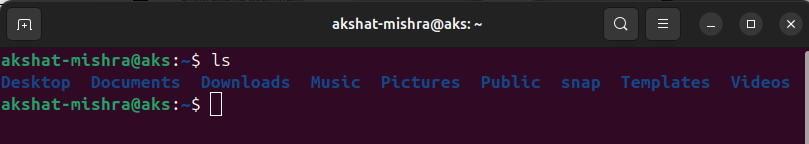
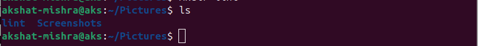
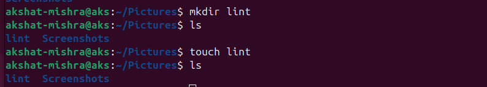
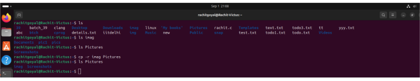
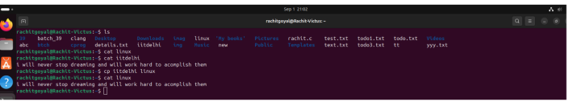
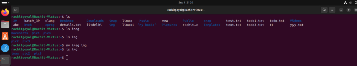
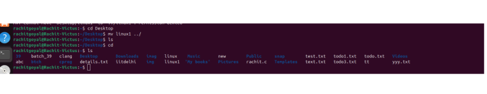

                 Experiment 2: Basic Linux Terminal Commands

                             Aim

       To understand and use basic Linux terminal commands, such as mkdir, which is used to create directories.

1. ls (list):

dispaly the contents of a directory

2. cd (change directory):

move between dierctories

3. pwd( print working directory):

show the current directory

4. mkdir(make directory):

create new directory

5. rmdir(remove directory):

delete directory 

6. rm (remove):

delete both files and directories

7. touch :

create a new empty file

8. cp (copy):

copy directories

copy files

9. mv(move):

move directoies

moves files 

                THNAK YOIU SIR

