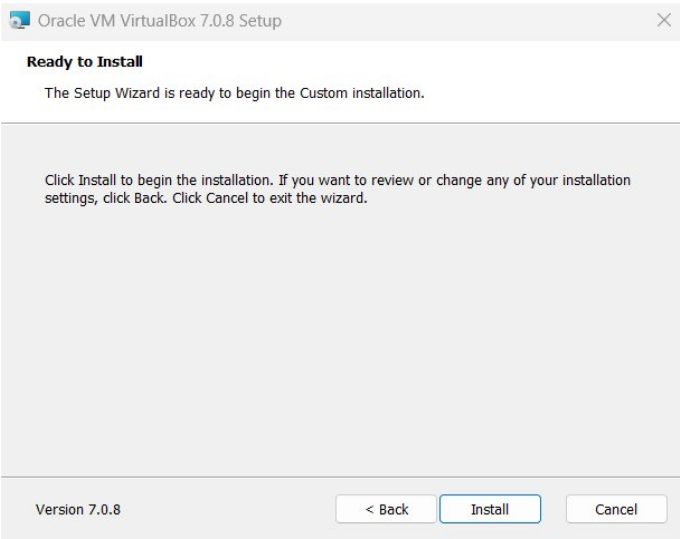

LAB 1 : INSTALL VIRTUAL PLAYER AND LINUX

WHAT IS LINUX ?

Linux is an open-source operating system kernel that serves as the foundation for various operating systems, commonly referred to as Linux distributions (or distros). Developed by Linus Torvalds in 1991, Linux is known for its stability, security, and versatility,making it popular for servers, desktops, embedded systems, and more.

STEP 1 : DOWNLOAD VIRTUALBOX FILE .

1 Go to the VirtualBox Website

2 Select Your Operating System

STEP 2 : INSTALLING VIRTUAL BOX

1 
 The beginning

2
 Select installation location

3
 Ready to install

4
installation complete

5 
opening the virtual box

STEP 3 : INSTALING LINUX USING VIRTUALBOX

1
 Naming virtual machine
 After installing virtual box ,click New .
 
 Write the Name you want for your system, for example: ubuntu

  Select Type: Linux.

 Select Version: Ubuntu.

2
 Set your  Username and Password

3
 assaign the  base memory and processor

4

 allocate disk storage to your virtual machine

STEP 4 :  Launching your System
   after powering on the virtual machine

1 
   first user interface 
   select select and install ubuntu

2
 installation of ubuntu will start
  it take upto 5 to 15 minute depending on your machine

3
 now you have entered  ubuntu 
 now you need to enter your password you made during setup

4
 select ubuntu pro 

 

5

 select share my data with ubuntu team

6

click finish to fianl your instalation of ubuntu

              congratulation you have sucessfully 
            installed ubuntu on your virtual machine
 
