experiment2
Here's a detailed tutorial on basic terminal commands that work on Linux, macOS, and Git Bash (Windows). These commands are essential for navigating and managing files from the terminal, especially for coding and version control (e.g., Git, VS Code, etc.).

# 1. navigation commands

## pwd - Print Working Directory
shows the current location  in the file system .

``` bash
pwd
```

 output example

``` bash
/home/akshat-mishra/Documents/GitHub/linux-lab
```


## ls - List Directory Contents
lists files and folder in the current directory .
``` bash
ls
```
 ls -l 
     [detailed list( permissions, size, date)]

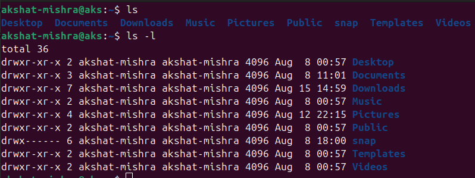

 ls-a 
  [ shows hidden files(those starting with .)]


 ls -la
 combined

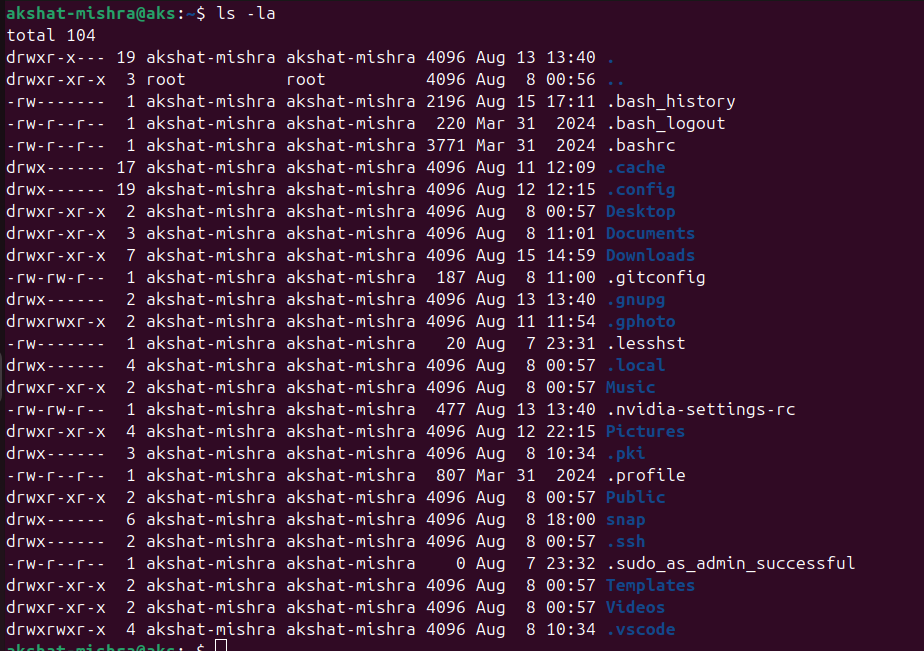


## cd - Change Directory
move into  a directory

``` bash
cd folder_name 
```
exmaples


``` bash
cd document          # go to Documents
cd ..                # go up one level    
cd /                 # go to roots 
cd ~                 # go to home directory
```
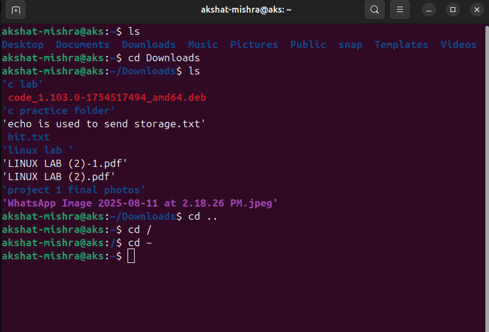

# 2. File and Directory Management

##  mkdir - make directory 

create a new folder.

``` bash
mkdir hello_folder
```

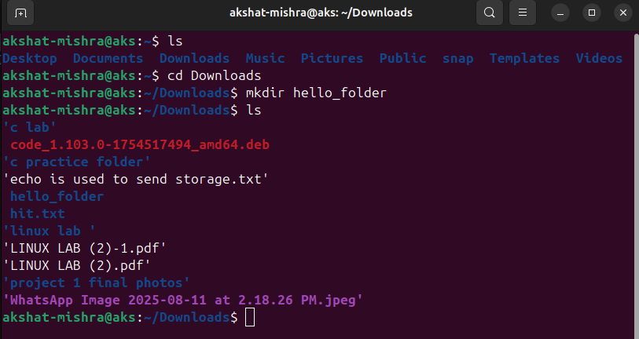

## touch - Create File

create an empty file.

``` bash
touch file.txt
```


## cp - Copy Files or Directories
``` bash
 cp file.txt file2.txt
 ```

 cp folder:
 ``` bash
 cp -r hello_folder bye_folder
 ```
 

 ## mv - Move or rename Files

 ```bash
mv oldname.txt newname.txt
 ```

  ```bash
 mv file.txt ~/documents/   # Move file
 ```
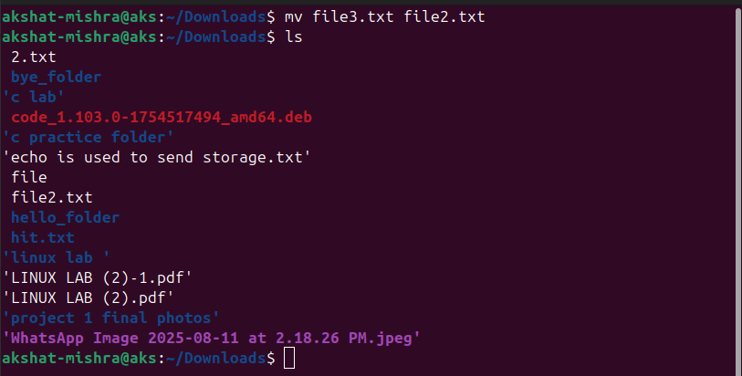

## rm - remove files

 ```bash
 rm file.txt          #delete file
 rm -r folder_name    #delte folder ( recursively)
 ```
 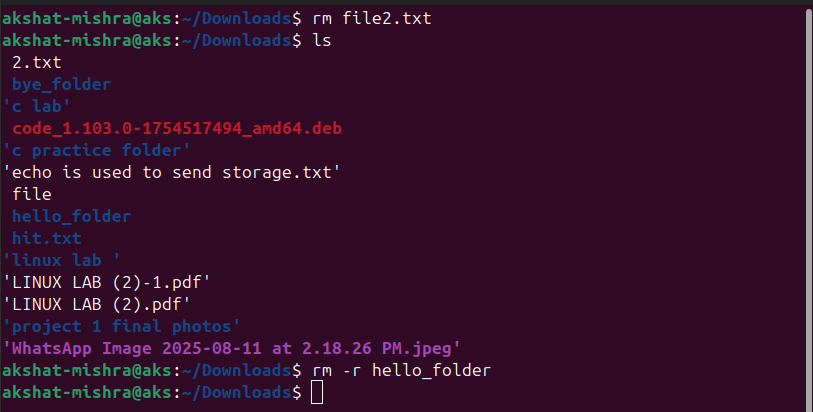

##  be careful!
there is no undo

# 3. File Viewing & Editing

## cat - view file contents
Displays content in terminal.
 ```bash
 cat file.txt
 ```
 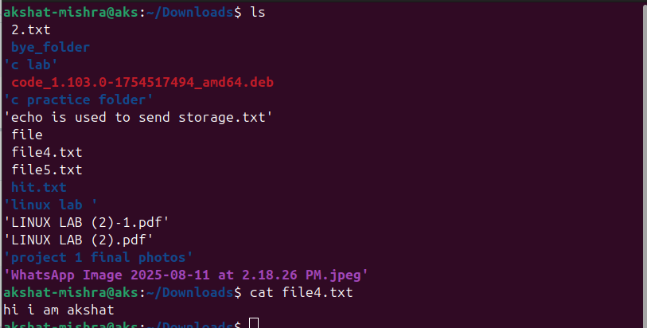

 ## nano -edit file in terminal 
 A basic terminal- based text editor.
  ```bash
  nano file.txt
 ```
 1. use aroow to move
 2. ctrl +o to save
 3. ctrl +x to exit

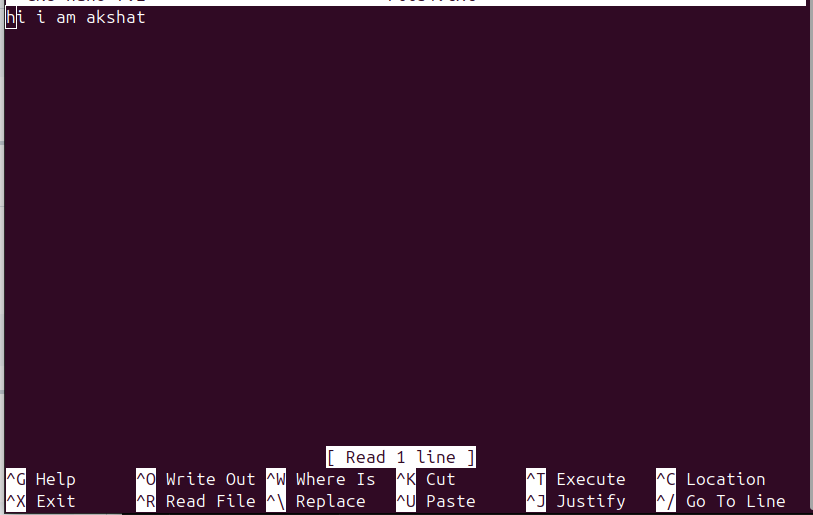

## clear - clear the terminal
 ```bash
 clear
 ```
 shortcut : CTRL + L

 

 # 4 . System Commands

   ## echo - print text

  useful for debugging or scripting.

   ```bash
   echo "hellow world"
 ```
 
 
  ## whoami - show current user

  ```bash
  whoami
  ```
  

  ## man- Manual for Any Command

  ```bash
  man ls
  ```
  use q to quit the manual.
  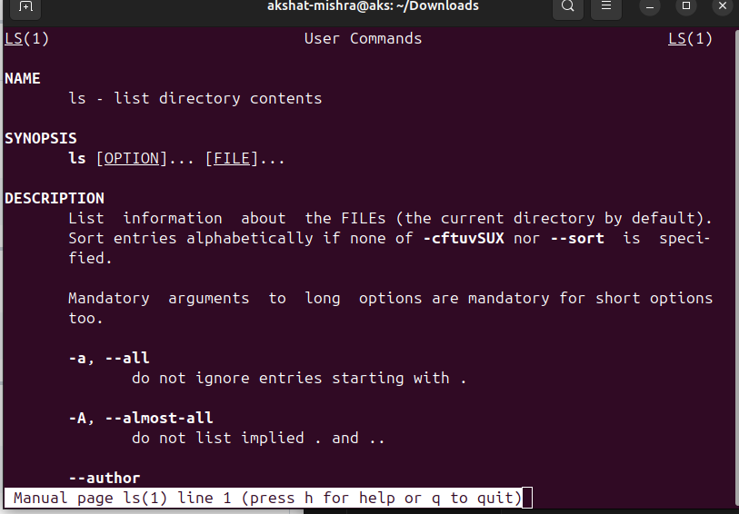

  # 5. searching and finding
  
  ## find - locate files

  ``` bash
  find . -name ".txt"
  ```
  find all .txt files in the current folder and subfolders.

  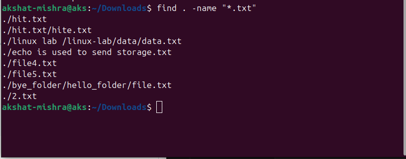

  ## grep - Search Inside Files
  ``` bash
  grep"hello" file.txt
  ```
 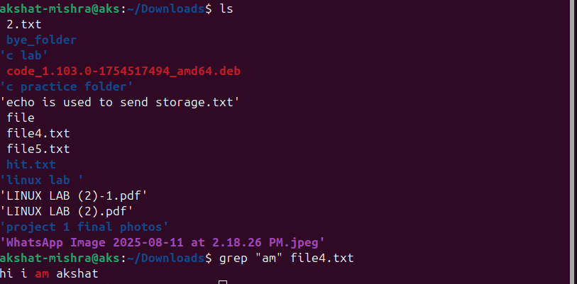

 # 6. helpful shortcut
 
  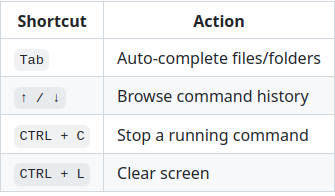

 # 7. Bonus : Chaining Commands
  
   ## run multiple commanands:
   ``` bash
   mkdir test && cd test && touch hello.txt
   ```
   

   ## run only if previous commnad succeeds:
   ``` bash
   &&
   ```
   ## run regards of sucess
   ``` bash
   ;
   ```
   
   # shell Tutorial - File Permissions with ``` bash chmod``` and ``` chown ```
   
   🔹 1. Understanding File Permissions in Linux
   
   Each file/directory in Linux has:
   
       Owner → The user who created the file.
       Group → A group of users who may share access.
       Others → Everyone else.
   
   Permission Types
   
       r → Read (4 in numeric)
       w → Write (2 in numeric)
       x → Execute (1 in numeric)
   
   Permission 
   
   exmaple from  ``` bash ls -l```
   
   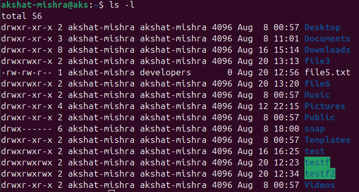
   
   ## 🔹 2. chmod – Change File Permissions
   Syntax
   
   ``` bash
   
   chmod [options] mode filename
   
   ```
   
   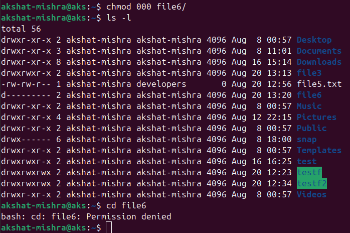
   
      Modes can be set in numeric (octal) or symbolic form.
   
   (A) Numeric (Octal) Method
   
   Each permission is represented as a number:
   
       Read = 4
       Write = 2
       Execute = 1
   
   Add them up:
   
       7 = rwx
       6 = rw-
       5 = r-x
       4 = r--
       0 = ---
   
   Example:
   
   chmod 755 script.sh
   
   Meaning:
   
       Owner: 7 → rwx
       Group: 5 → r-x
       Others: 5 → r-x
   
   
    
   
   (B) Symbolic Method
   
   Use u (user/owner), g (group), o (others), a (all). Operators:
   
       + → Add permission
       - → Remove permission
       = → Assign exact permission
   
   Examples:
   
   chmod u+x script.sh     # Add execute for owner
   chmod g-w notes.txt     # Remove write from group
   chmod o=r file.txt      # Set others to read only
   chmod a+r report.txt    # Everyone gets read access
   
   (C) Recursive Changes
   
   chmod -R 755 /mydir
   
       ``` bash -R → applies changes recursively to all files/subdirectories.```
   
   
   
    after use of recrsive changes   
   
   
   
   
     3. chown – Change File Ownership
   Syntax
   
   ``` bash
   chown [options] new_owner:new_group filename
   ```
   Examples:
   
   ``` bash
   chown vibhu file.txt           # Change owner to user 'vibhu'
   chown vibhu:dev file.txt       # Change owner to 'vibhu' and group to 'dev'
   chown :dev file.txt            # Change only group to 'dev'
   chown -R vibhu:dev /project    # Recursive ownership change
   ```
   
   

   ## 🔹 4. Putting It All Together
   Example Scenario
   ``` bash
   touch project.sh
   ls -l project.sh
   ```
   
   
   
   `
   Output:
   ``` bash
   -rw-r--r-- 1 vibhu dev 0 Aug 19 12:00 project.sh
   ```
   Now:
   ``` bash
   chmod 700 project.sh       # Only owner has rwx
   chmod u+x,g-w project.sh   # Add execute for user, remove write for group
   chown root:admin project.sh # Change owner to root and group to admin
   ```
   
   1.
   
   
   
   2.
   
   
   3.
   
   
   
   ## 5. quick refrence table 
   
   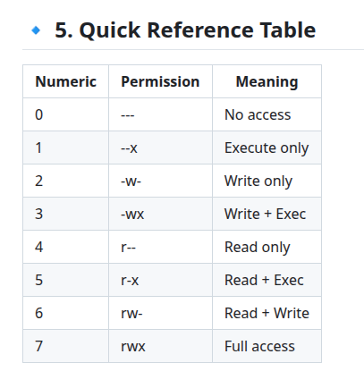
   
   key tip: use numberic for quick setting (e.g. , 755,644) and symbolic for fine adjustments( u+x, g-w)

 ### 📌 Q1 what is the difference between chmod and chown?
    ans=chown-change ownership
         change the owner and group of a file or directory
        
        chmod-change permissions
         changes the permissions for the owner,group, and others
        
### 📌 Q2 how do you check current directory and user?

      ans= by using the pwd command.

      


 