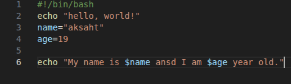
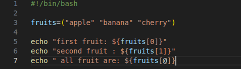
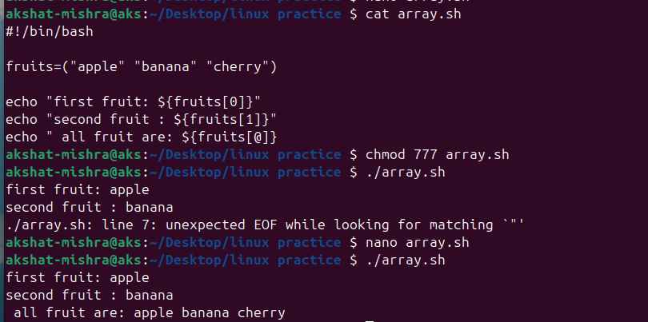

# Assignment 2 – Script Execution & Explanation
## Objective: Understand how existing scripts in repo work
```
In this assignment in have taken two  shell scripts :-
1. array.sh
2. hello.sh
```
## 1. script execution 

### 1. hello.sh
 

 ## in this code
 ```
  1. "#!/bin/bang" :-this line is  know as shebang
  2. echo"hello world!":-  printing hello world
  3.  name = "akshat":-  takiong akshat in variable name  
  4.  age = 19 :- taking 19 as age
  5. echo"my name is $name and I am $age year old." -printing name and age

  ```

  ! [images](./images2/3.png) 

### 2. array.sh


## in the code
```
#!/bin/bash :- shebang

fruits=("apple" "banana" "cherry") :- in this statement we declare fruit as array 

echo "first fruit: ${fruits[0]}" :- printing the first fruit
echo "second fruit : ${fruits[1]}" :- printing the second fruit
echo " all fruit are: ${fruits[@]} :- printing all the fruits 

```


### 🔧 Q1 what is the purpose of #!/bin/bash at the top of the script

    ans= the shebang line at the top of a script specifies the interpreter that should be used to the run the script.

### 🔧 Q2 how do you make a script executable?
    ans = 1. add the shebang at the top
          2. give permission using the chmod command
          3. run the code.